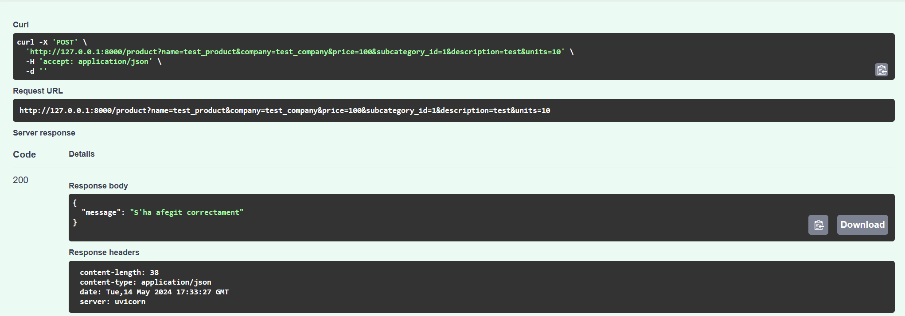
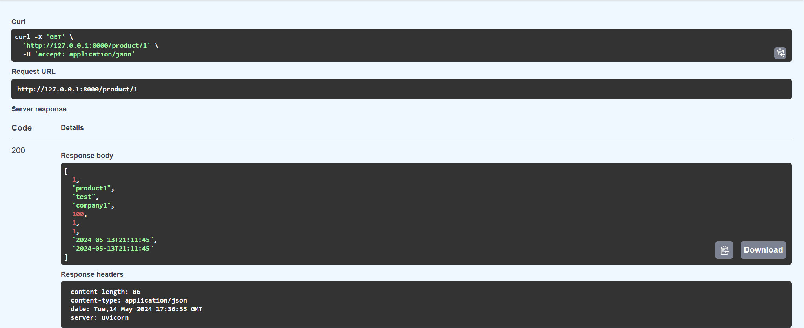
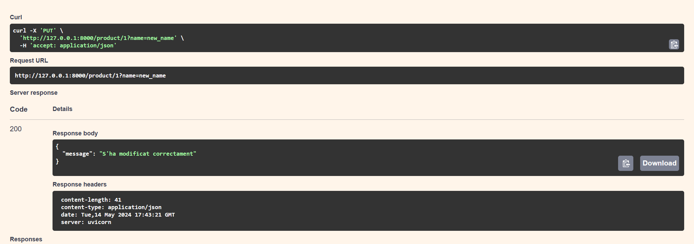
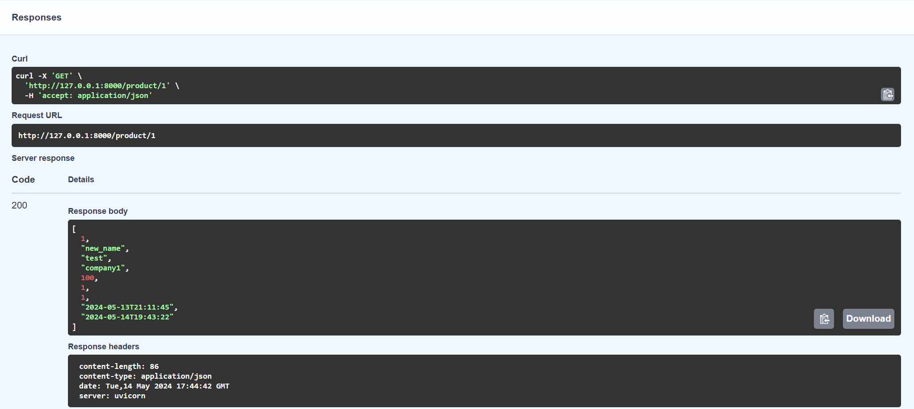
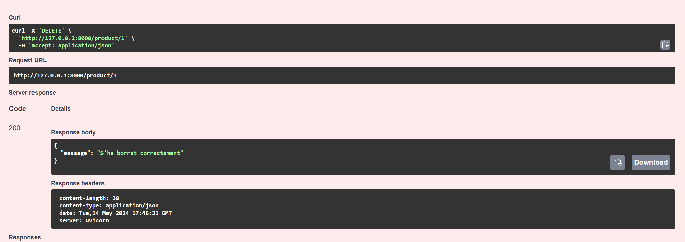
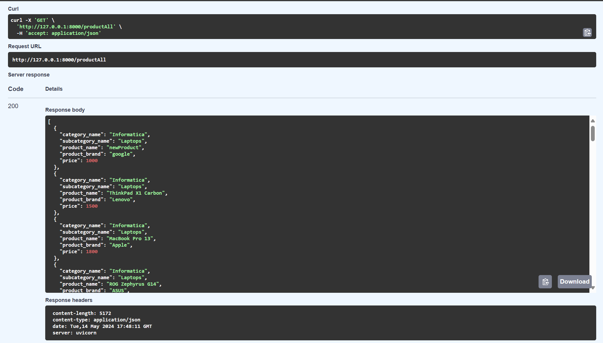
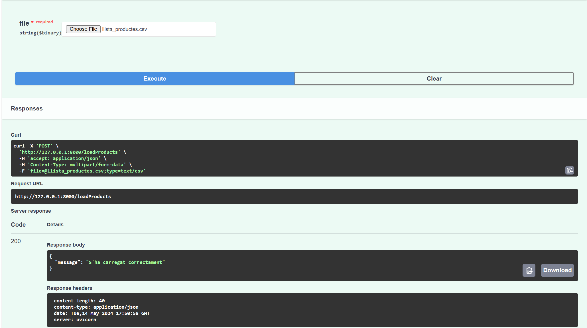
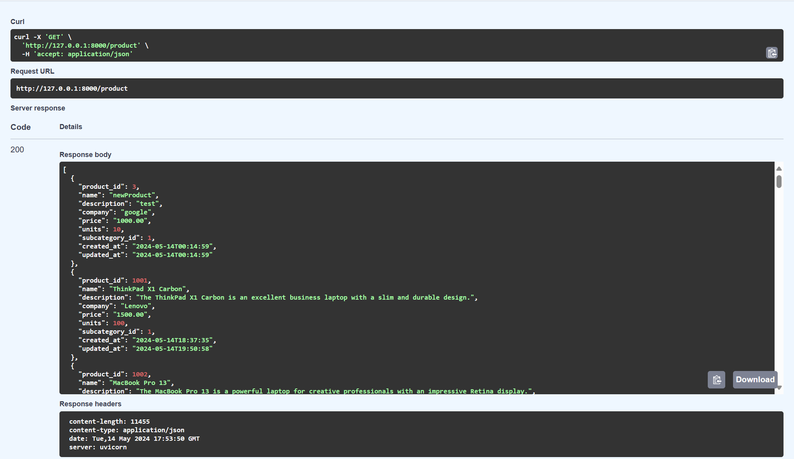

# API_Botiga

## Get /product/

## Post /product/

lo comprobamos con el siguiente endpoint get /product/{id}

## Get /product/{id}

## Put /product/{id}

comprovación:

## Delete /product/{id}

comprovación:

## Get /productAll/

## Post /loadProducts

comprovación:
