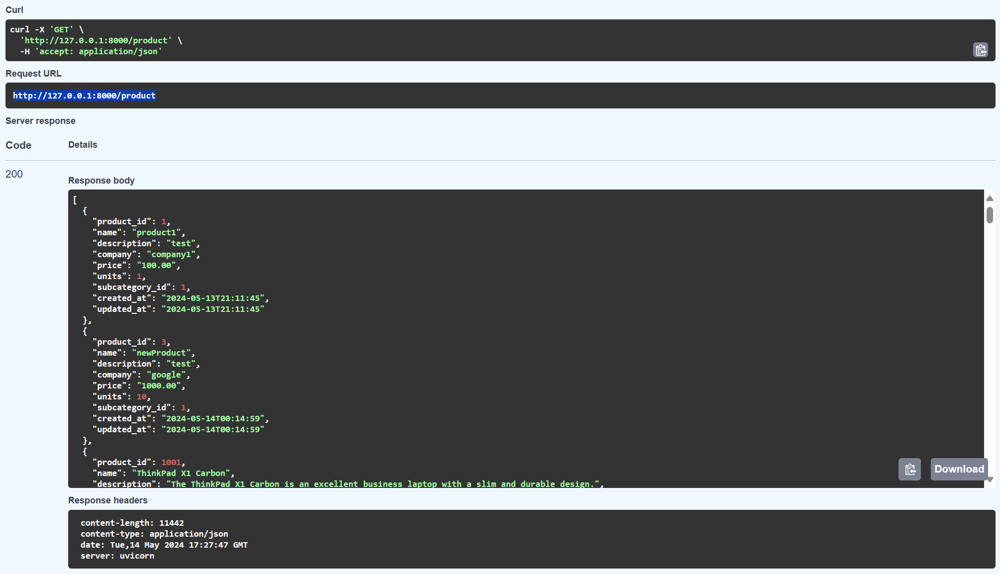
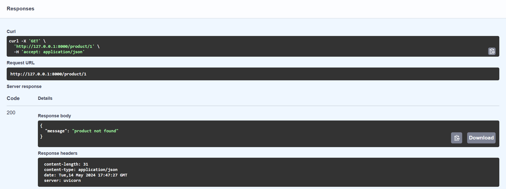

# API_Botiga

La práctica consiste en generar un api REST con fastAPI apartir de una base de datos mariaDB. Esta base de datos tiene 3 tablas(category, subcategory, product). Esta aplicación nos permite hacer CRUD simples contra esta base de datos.

## Index 

1 [Get /product/](#get-product)  
2 [Post /product/](#post-product)  
3 [Get /product/{id}](#get-productid)  
4 [Put /product/{id}](#put-productid)  
5 [Delete /product/{id}](#delete-productid)  
6 [Get /productAll/](#get-productall)  
7 [Post /loadProducts](#post-loadproducts)  
8 [Opcionales](#opcionales)

## Get /product/

## Post /product/

lo comprobamos con el siguiente endpoint get /product/{id}

## Get /product/{id}

## Put /product/{id}

comprovación:

## Delete /product/{id}

comprovación:

## Get /productAll/

## Post /loadProducts

comprovación:

## Opcionales

